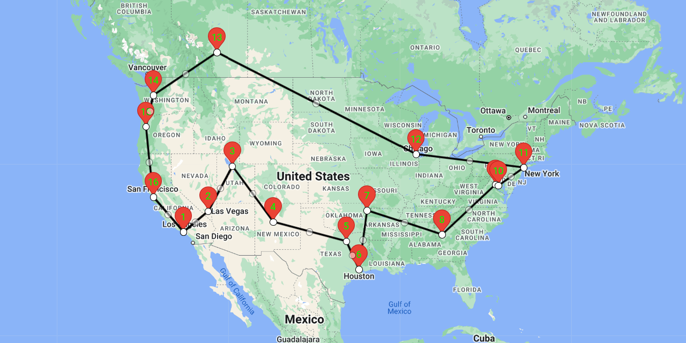

# 🌎 Travelnetics ([demo](https://travelnetics.azurewebsites.net/travelnetics/))
The Traveling Salesman Problem statement is as follows:
  ```Given a list of cities and the distances between each pair of cities, what is the shortest possible route that visits each city exactly once and returns to the origin city?```

This problem is **NP-hard** because it is as hard as a NP-Complete problem Hamilton Cycle and doesn't have an efficient certifier (not necessarily need this to be NP-Hard though). It can not be solved within polynomial time. The reason is this:
Suppose there are 19 cities in total, then I have 19 choices of which city should I travel first, 18 choices of which
city should I travel second, ..., 1 choice of which city should I travel at last. In total, that is **19!** possibilities,
out of the **19!** possibilities, I pick the one that has the shortest total distance.

If my computer can test **one billion** tours per second. It is going to take **19!/1,000,000,000** seconds ~ **3.85 years**
to finish. Therefore, it is unfeasible to enumerate all possibilities. This project proposes a partial solution using
`Genetic Algorithm` and calls `Google Maps API` to visualize. You can also utilize this project to plan your travel over 100+ places with ease.

### You can see a demo [here](https://travelnetics.azurewebsites.net/travelnetics/)
(please note that I am using my personal Google Maps API key to host the demo. So I've set up restrictions of daily usage limit.
If you see Google Map does not load correctly. It means the daily limit was exceeded. The settings for the demo site are
`population` of 128, `numIterations` of 10000, `mutChance` of 0.2, and `returnToOrigin` set to true)

## ▶️ Steps to Run Locally
1. Replace `apiKey` attribute in `config.js` with your own Google Maps API Key. If you do not have
   one, here is the [link](https://developers.google.com/maps/documentation/javascript/get-api-key)
   to create one (❗❗❗ Note: Fees charged by Google may apply ❗❗❗)
2. Open `index.html`, type an address in the search bar and Google Maps' Autocomplete API will
   show you a list of addresses. click on one will add a waypoint, the **first** waypoint added is the origin
3. Click `Calculate Best Route!` at the bottom of `index.html`, enjoy!

## ⚙️ Customize Yourself
### Edit `config.js`, which contains the following fields:
- `popSize`: An `integer` == Population size == The total number of individual routes
- `numIterations`: A `number` > `0` == How many iterations the Genetic Algorithm should run. Generally the
more iterations, the more GA converges
- `mutChance`: A `float` between `0` and `1` == Mutation chance, as explained in `How Does It Work?`
- `returnToOrigin`: A `boolean` == Should the solution include going back to origin?

## 💡 How Does It Work?
### [Medium Article](https://medium.com/@realymyplus/introduction-to-genetic-algorithm-with-a-website-to-watch-it-solve-traveling-salesman-problem-live-a21105a3251a)

## ⚠️Known Defects
- This project solely calculates the distance between 2 waypoints using **Haversine distance**.
  However, this approach has 2 major disadvantages:
  - **Shortest distance** is not always equal to **shortest time**
  - **Haversine distance** calculates the distance of a straight line between 2 waypoints,
  whereas there are other factors involved in the **shortest distance** such as the
  **existence/straightness of a road** and/or **elevation**
  - All of the above 2 problems can be solved by simply querying [Google Maps' Directions API](https://developers.google.com/maps/documentation/directions/overview),
  but again, Google Maps charges very high for this API. In future versions, will add
  support to let the user decide whether to use [Google Maps' Directions API](https://developers.google.com/maps/documentation/directions/overview)
  or **Haversine distance** for calculating distances
- Genetic Algorithm **does not gurantee** to generate the **global optimal solution** since
  Genetic Algorithm may converge fairly quickly. This is why we want `mutChance` for mutation
  to add a little bit of randomness here

## 🏆Acknowledgments && Disclaimers
- This project's idea originates from `ITP 435-Professional C++` taught at the
  `University of Southern California` designed by [Sanjay Madhav](https://viterbi.usc.edu/directory/faculty/Madhav/Sanjay)
- This is the first time I ever touched Javascript. I am a lifelong C++|Python|Java|PHP developer.
  So please bear with me if my Javascript coding style is a mess. Any suggestions are
  more than welcome!